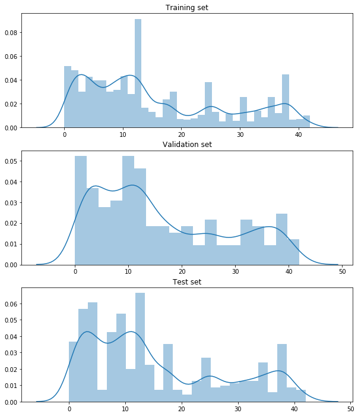
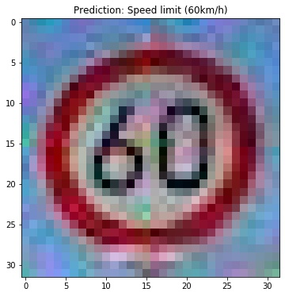
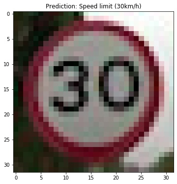
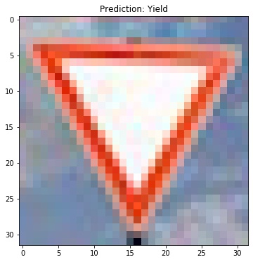
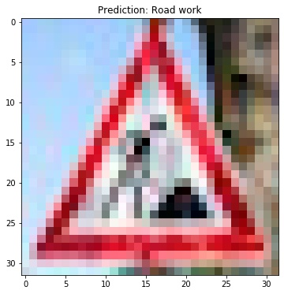
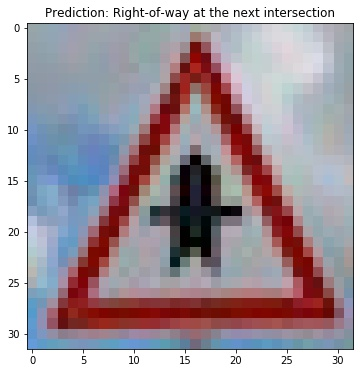

# **Traffic Sign Recognition** 

## Writeup

---

**Build a Traffic Sign Recognition Project**

The goals / steps of this project are the following:
* Load the data set (see below for links to the project data set)
* Explore, summarize and visualize the data set
* Design, train and test a model architecture
* Use the model to make predictions on new images
* Analyze the softmax probabilities of the new images
* Summarize the results with a written report

## Rubric Points
Here I will consider the [rubric points](https://review.udacity.com/#!/rubrics/481/view) individually and describe how I addressed each point in my implementation.  

---
### Writeup / README

#### 1. Provide a Writeup / README that includes all the rubric points and how you addressed each one. You can submit your writeup as markdown or pdf. You can use this template as a guide for writing the report. The submission includes the project code.

You're reading it!

[Project code (notebook)](https://github.com/tongwang01/CarND-Traffic-Sign-Classifier-Project/blob/master/Traffic_Sign_Classifier-TongAnswer.ipynb)

[Project code (html)](https://github.com/tongwang01/CarND-Traffic-Sign-Classifier-Project/blob/master/Traffic_Sign_Classifier-TongAnswer.html)

### Data Set Summary & Exploration

#### 1. Provide a basic summary of the data set. In the code, the analysis should be done using python, numpy and/or pandas methods rather than hardcoding results manually.

I looked at:
- The shapes and sizes of training / validation / test data sets
- Displayed a couple of sample images
- The distribution of class labels  
    * The distribution of label classes are roughly the same across training, validation and test sets. This is good.
    * Some of the most common classes are 2, 1, 13, etc.

#### 2. Include an exploratory visualization of the dataset.

Here's an histogram of class labels:

### Design and Test a Model Architecture

#### 1. Describe how you preprocessed the image data. What techniques were chosen and why did you choose these techniques? Consider including images showing the output of each preprocessing technique. Pre-processing refers to techniques such as converting to grayscale, normalization, etc. (OPTIONAL: As described in the "Stand Out Suggestions" part of the rubric, if you generated additional data for training, describe why you decided to generate additional data, how you generated the data, and provide example images of the additional data. Then describe the characteristics of the augmented training set like number of images in the set, number of images for each class, etc.)

I normalized the input data by applying `(pixel - 128)/ 128`.

#### 2. Describe what your final model architecture looks like including model type, layers, layer sizes, connectivity, etc.) Consider including a diagram and/or table describing the final model.

I implemented my modeling using Keras.

Model architecture:
* Input
* Convolution (32 filters, 3x3 stride)
* Convolution (32 filters, 3x3 stride)
* MaxPooling (2x2 pool size)
* Dropout (0.25)
* Convolution (64 filters, 3x3 stride)
* Convolution (64 filters, 3x3 stride)
* MaxPooling (2x2 pool size)
* Dropout (0.25)
* 2 fully connected layers that map to output logits
* (All activation functions are relu)

 

#### 3. Describe how you trained your model. The discussion can include the type of optimizer, the batch size, number of epochs and any hyperparameters such as learning rate.

I used the Adam optimizer to train the model. It is trained with a batch size of 32 over 10 epochs.

#### 4. Describe the approach taken for finding a solution and getting the validation set accuracy to be at least 0.93. Include in the discussion the results on the training, validation and test sets and where in the code these were calculated. Your approach may have been an iterative process, in which case, outline the steps you took to get to the final solution and why you chose those steps. Perhaps your solution involved an already well known implementation or architecture. In this case, discuss why you think the architecture is suitable for the current problem.

My final model results were:
* training set accuracy of 96.6%
* validation set accuracy of 94.3%
* test set accuracy of 92.5%

I got somewhat lucky and my first implementation achieved validation accuracy of ~92%. I trained the model over more epochs (10) and it managed to reach a validation set accuracy of 94.3%. The validation loss is still decreasing by the end of 10 epochs, so I suspect that given more training time we could potentially achieve even better performance. 

I think the dropout layers could have helped preventing the modeling from overfitting.

### Test a Model on New Images

#### 1. Choose five German traffic signs found on the web and provide them in the report. For each image, discuss what quality or qualities might be difficult to classify.

I downloaded 5 German traffic signs from the web. I manually converted them into 32 x 32 pixel images. 
#### 2. Discuss the model's predictions on these new traffic signs and compare the results to predicting on the test set. At a minimum, discuss what the predictions were, the accuracy on these new predictions, and compare the accuracy to the accuracy on the test set (OPTIONAL: Discuss the results in more detail as described in the "Stand Out Suggestions" part of the rubric).

Following are these images and the respective predicted class names from the model.

#### 3. Describe how certain the model is when predicting on each of the five new images by looking at the softmax probabilities for each prediction. Provide the top 5 softmax probabilities for each image along with the sign type of each probability. (OPTIONAL: as described in the "Stand Out Suggestions" part of the rubric, visualizations can also be provided such as bar charts)

Results for this section is generated by the `top_5_classes()` function in the notebook.

For images 2, 3, and 5 the model is rather confident - probabiliy of the predicted class is over 99%. For images 1 and 4 it is less confident (92.5% and 86.7% respectively). For image 1 the second canidate is "speed limit (50kph)", which seems logical.

### (Optional) Visualizing the Neural Network (See Step 4 of the Ipython notebook for more details)
#### 1. Discuss the visual output of your trained network's feature maps. What characteristics did the neural network use to make classifications?

